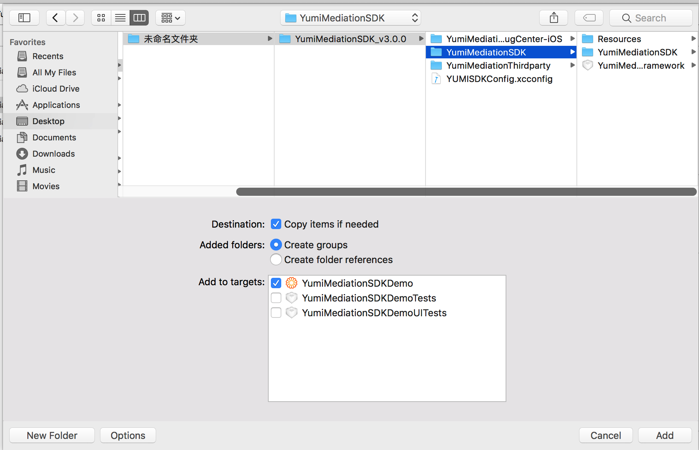
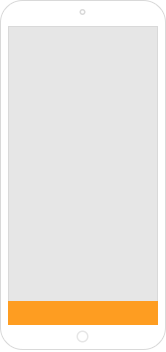

[TOC]

# YumiMediationSDK for Unity

## Summary

1. To Readers

   This documentation is intended for developers who want to integrate Yumimobi SDK in Unity products.

2. Develop Environment

   Xcode 7.0 and above

   iOS 8.0 and above

3. [Get Demo ](https://github.com/yumimobi/YumiMediationSDKDemo-iOS.git)   

## Import YumiMediationPlugins.unitypackage

1. Double-click YumiMediationPlugins.unitypackage and import all files into Unity project

    

2. Add Component 

   Correlate YumiMediationSDKEventListener.cs and YumiMediationSDKManager.cs to the scene that you need.

3. Export Xcode project

## Develop Encironment Configuration 

### App Transport Security

ATS (App Transport Security) proposed by WWDC 15 features an important method for Apple to boost network communication security. Non-HTTPS access will be banned by default for ios 9 and later.

As most of materials are provided by HTTP, please set as the followings to improve fillrate：

```objective-c
<key>NSAppTransportSecurity</key>
<dict>
    <key>NSAllowsArbitraryLoads</key>
    <true/>
</dict>
```


*The `NSAllowsArbitraryLoads` exception is required to make sure your ads are not impacted by ATS on iOS 9 devices, while `NSAllowsArbitraryLoadsForMedia` and `NSAllowsArbitraryLoadsInWebContent` are required to make sure your ads are not impacted by ATS on iOS 10 devices.*

### Permissions for ios 9 and later

Upload app to App Store, and add the following peimissions to info.plist.

```objective-c
<-- Calendar -->
<key>NSCalendarsUsageDescription</key>
<string>App shall access calendar with your permission</string>
<!-- Photos -->
<key>NSPhotoLibraryUsageDescription</key>
<string>App shall access photos with your permission</string>
```
## Integration Method

1. CocoaPods ( recommend )

   CocoaPods is a dependency manager for ios, which will make it easy to manage YumiMediationSDK.

   Open Podfile, add one of the following methods to target.

   If use CocoaPods for the first time, please view [CocoaPods Guides](https://guides.cocoapods.org/using/using-cocoapods.html) 。

   1. If need YumiMediationSDK only:

      ```ruby
      pod "YumiMediationSDK"
      ```

   2. If also need other platforms:

      ```ruby
      pod "YumiMediationAdapters", :subspecs => ['AdColony','AdMob','AppLovin','Baidu','Chartboost','Domob','Facebook','GDT','InMobi','IronSource','StartApp','Unity','Vungle','PlayableAds','Centrixlink','Mobvista','OneWay','TouTiao']
      ```

   Then run the followings at command line interface:

   ```ruby
   $ pod install --repo-update
   ```

   Finally, open project by workspace.。

2. Manually Integrating YumiMediationSDK

   1. Choose third-party SDK

   2. Download third-party SDK

   3. Download YumiMediationSDK

   4. Add YumiMediationSDK to your project

    

    


## Code Sample

### Advertisement Forms

#### Banner

##### Initialization

```c
//banner position
public enum YumiMediationBannerPosition{
		YumiMediationBannerPositionTop,
		YumiMediationBannerPositionBottom
	}
```

```c
YumiMediationSDK_Unity.initYumiMediationBanner("Your PlacementID","Your channelID",
                                               "Your versionID",                                             YumiMediationSDK_Unity.YumiMediationBannerPosition.YumiMediationBannerPositionBottom);
```

##### Request banner

```c
YumiMediationSDK_Unity.loadAd(false);
```

##### Remove Banner

```c
YumiMediationSDK_Unity.removeBanner();
```

##### Delegate implementation 

```c#
void yumiMediationBannerViewDidLoadEvent()
{
	Debug.Log("YumiMediationSDKBanner,didLoaded");
}
void yumiMediationSDKDidFailToReceiveAdEvent(string error)
{
	Debug.Log("YumiMediationSDKBanner,didFailToReceiveAd");
}
void yumiMediationBannerViewDidClickEvent()
{
	Debug.Log("YumiMediationSDKBanner,didClickedAd");
}
```

##### Self-adaptation

```objective-c
YumiMediationSDK_Unity.loadAd(false);
```

You are available to set whether to turn on self-adaptation when making banner request.

If isSmartBanner is YES ,YumiMediationBannerView will automatically adapt to size of device.

   

​	*non self-adaptation mode* 		  *self-adaptation mode*										

#### Interstitial

##### Initialization and interstitial request

```c#
YumiMediationSDK_Unity.initYumiMediationInterstitial("Your PlacementID",
                                                     "Your channelID",
                                                     "Your versionID");
```

##### Show Interstitial

```c#
YumiMediationSDK_Unity.present();
```

##### Delegate implementation

```c#
void yumiMediationInterstitialDidReceiveAdEvent(){
	Debug.Log ("YumiMediationInterstital, DidReceiveAd");
}
void yumiMediationInterstitialDidFailToReceiveAdEvent(string error){
	Debug.Log ("YumiMediationInterstital, DidFailToReceiveAd");
}
void yumiMediationInterstitialWillDismissScreenEvent(){
	Debug.Log ("YumiMediationInterstital, WillDismissScreen");
}
void yumiMediationInterstitialDidClickEvent() {
	Debug.Log ("YumiMediationInterstital, DidClicked");
}
```

#### Rewarded Video

##### Initialization and rewarded video request

```c#
YumiMediationSDK_Unity.loadYumiMediationVideo("Your PlacementID",
                                              "Your channelID",
                                              "Your versionID");
```

##### Determine whether rewarded video is ready.

```c#
bool isplay = YumiMediationSDK_Unity.isVideoReady();
```

##### Show rewarded video

```c#
YumiMediationSDK_Unity.playVideo();
```

##### Delegate implementation

```objective-c
void yumiMediationVideoDidOpenEvent(){
  	Debug.Log ("YumiMediationVideo, DidOpen");
}
void yumiMediationVideoDidStartPlayingEvent(){
	Debug.Log ("YumiMediationVideo, DidStartPlaying");
}
void yumiMediationVideoDidCloseEvent(){
	Debug.Log ("YumiMediationVideo, DidClosed");
}
void yumiMediationVideoDidRewardEvent(){
	Debug.Log ("YumiMediationVideo, DidRewarded");
}
```

## Debug Mode

Please select debug mode if you want to test whether ad ruturn is available for an app.

Please ensure your app has initialized YumiMediationSDK before calling debug mode.

### Integration Method

- CocoaPods ( recommend )

  ```ruby
  pod "YumiMediationDebugCenter-iOS" 
  ```


- Manually Integrating YumiMediationSDK

  Unzip the downloaded file to get our ``YumiMediationDebugCenter-iOS.framework``. Select this framework and add them to your project. Make sure to have 'Copy Items' checked.

### Call debug mode

```objective-c
#import <YumiMediationDebugCenter-iOS/YumiMediationDebugController.h>

[[YumiMediationDebugController sharedInstance] 
	presentWithBannerPlacementID:@"Your BannerPlacementID"
	     interstitialPlacementID:@"Your interstitialPlacementID"
	            videoPlacementID:@"Your videoPlacementID"
	           nativePlacementID:@"Your nativePlacementID"
	                   channelID:@"Your channelID"
	                   versionID:@"Your versionID"
	          rootViewController:self];//your rootVC
```

### Sample


  										*Select platform integration category*


 								   *Select single platform, the grey indicates  not configurated yet*


​									*select ad category, debug single platform*


