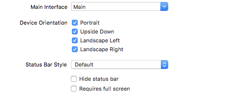
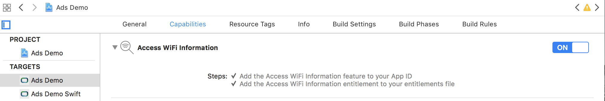

[TOC]
# Thirdparty Network Configuration
## AdColony
### Step 1: Configuring Supported Orientations
The AdColony SDK requires your app support all orientations globally. This requirement is in place because AdColony ads may be shown in any orientation, and our view controller needs your app to support that behavior. Please note that this requirement does not dictate that your app's interface support all orientations; you just have to override the global settings in your view controllers' `supportedInterfaceOrientations` method.

The easiest way to satisfy this requirement is by selecting all possible orientations under the **General** tab of your Xcode target:

Note that, instead of selecting all possible orientations under the General tab, you can also override the `application:supportedInterfaceOrientationsForWindow:` method of your AppDelegate class:
``` objectivec
#import <AdColony/AdColony.h>

@implementation AppDelegate
/* Class body ... */

-(UIInterfaceOrientationMask)application:(UIApplication *)application supportedInterfaceOrientationsForWindow:(UIWindow *)window {
return UIInterfaceOrientationMaskAll;
}
```
### Step 2: Configuring URL Schemes
With the release of iOS 9, Apple also restricted usage of the `canOpenURL:` API, which AdColony uses to make decisions about whether or not we can land users in certain apps from our Dynamic End Cards (DECs). For example, one of our ad units could be for a new movie, and the associated DEC may present functionality to the user that allows them to send a tweet about it using the Twitter app. This kind of functionality is still possible in iOS 9, but publishers must enable it for the applications AdColony links to by authorizing each app’s URL scheme in their plist. Note that if the schemes are not added, users will be taken to the app’s website instead, which may result in an undesirable user experience - having to login to the site, for example. In order to enable deep-linking for the apps the AdColony SDK uses, please add the following entry to your app's plist:
``` xml
<key>LSApplicationQueriesSchemes</key>
<array>
<string>fb</string>
<string>instagram</string>
<string>tumblr</string>
<string>twitter</string>
</array>
```
### Step 3: Configuring Privacy Controls (Optional)
n iOS 10, Apple has extended the scope of its privacy controls by restricting access to features like the camera, photo library, etc. In order to unlock rich, immersive experiences in the SDK that take advantage of these services, please add the following entry to your apps plist:
``` xml
<key>NSPhotoLibraryUsageDescription</key>
<string>Some ad content may require access to the photo library.</string>
<key>NSCameraUsageDescription</key>
<string>Some ad content may access camera to take picture.</string>
<key>>NSMotionUsageDescription</key>
<string>Some ad content may require access to accelerometer for interactive ad experience.</string>
```
## Baidu
### iOS9 适配说明:
1. ENABLE_BITCODE=YES. SDK 已支持 BITCODE,若不需要则直接设置为 NO 即可
2. 设置 Capabilities 里打开 KeyChain Sharing, 同时在开发者中心进行相应设置, 以推送更精准广告
### iOS9 configuration:
1. ENABLE_BITCODE=YES. The SDK already supports BITCODE, If you don't need it, just set it to No.
2. In order to obtain more accurate advertising services. Open `KeyChain Sharing` in `XCode Capabilities`, and make the corresponding Settings in your Apple developer center.

## InMobi
### iOS 12 WiFi Settings
Apple has introduced privacy settings to access WiFi details from iOS 12 onwards. To boost monetization and relevant user experience we encourage sharing WiFi details for targeted advertising.

#### Step 1: Enable ‘Access WiFi Information’ on your App ID.

#### Step 2: Enable access ‘Access WiFi Information’ for your target app from XCode capabilities.

#### Step 3: Ensure WiFi Access is added to your `App.entitlements` file.


## Vungle
###  Remove the iOS Status Bar
Although this step is not required, we recommend that you remove the iOS status bar to ensure that Vungle's ad interaction and presentation perform smoothly. To remove the status bar, open your Info.plist, add the key `View controller-based status bar appearance`, and set it to `No`.


