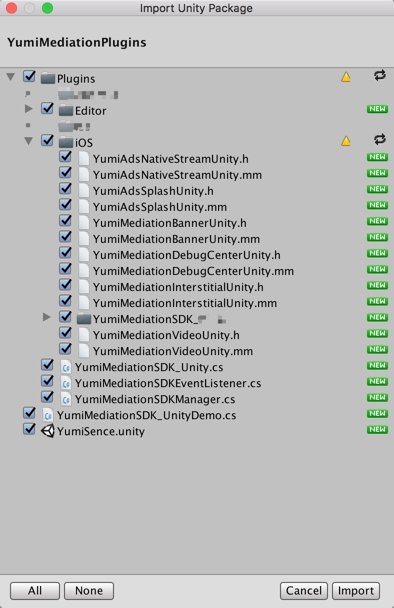
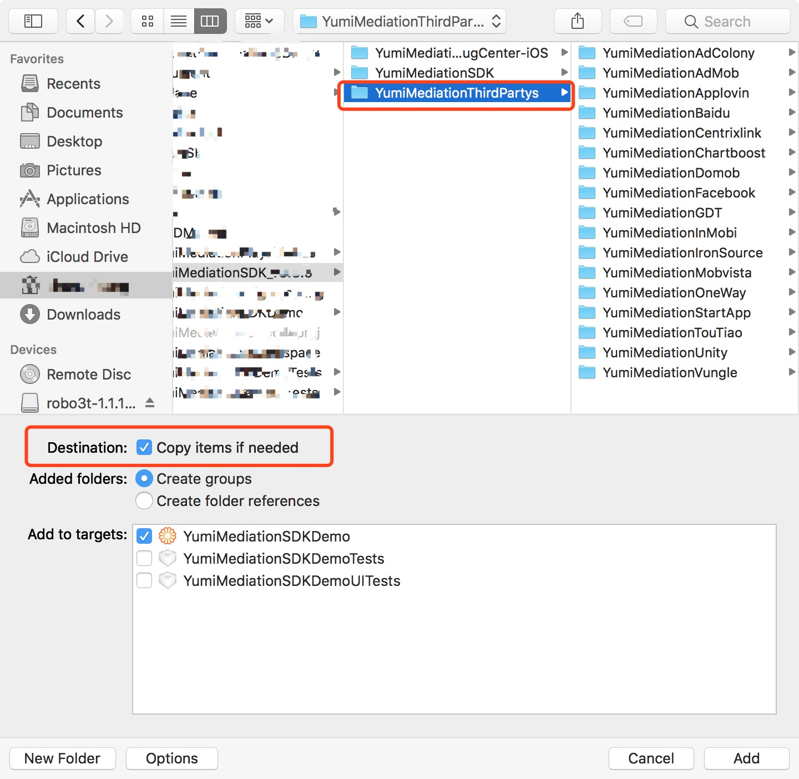

* [YumiMediationSDK for Unity](#yumimediationsdk-for-unity)   
   * [Summary](#summary)   
   * [Import YumiMediationPlugins.unitypackage](#import-yumimediationpluginsunitypackage)   
   * [Develop Encironment Configuration](#develop-encironment-configuration)   
      * [App Transport Security](#app-transport-security)   
      * [Permissions for ios 9 and later](#permissions-for-ios-9-and-later)   
   * [Third-party SDK Integration Method](#third-party-sdk-integration-method)
   * [Code Sample](#code-sample)   
      * [Advertisement Forms](#advertisement-forms)   
         * [Banner](#banner)   
            * [Initialization](#initialization)   
            * [Reset banner size](#reset-banner-size)   
            * [Request banner](#request-banner)   
            * [Remove Banner](#remove-banner)   
            * [Delegate implementation](#delegate-implementation)   
            * [Self-adaptation](#self-adaptation)   
         * [Interstitial](#interstitial)   
            * [Initialization and interstitial request](#initialization-and-interstitial-request)    
            * [Show Interstitial](#show-interstitial)   
            * [Delegate implementation](#delegate-implementation-1)   
         * [Rewarded Video](#rewarded-video)   
            * [Initialization and rewarded video request](#initialization-and-rewarded-video-request)   
           * [Determine whether rewarded video is ready.](#determine-whether-rewarded-video-is-ready)   
            * [Show rewarded video](#show-rewarded-video)   
            * [Delegate implementation](#delegate-implementation-2)   
   * [Debug Mode](#debug-mode)   
      * [Call debug mode](#call-debug-mode)   
      * [Reset banner size of debug mode](#reset-banner-size-of-debug-mode)   
      * [Sample](#sample)   
      
# YumiMediationSDK for Unity

## Summary

1. To Readers

   This documentation is intended for developers who want to integrate Yumimobi SDK in Unity products.

2. Develop Environment

   Xcode 7.0 and above

   iOS 8.0 and above

3. [Get Demo ](https://github.com/yumimobi/YumiMediationSDKDemo-iOS.git)   

## Import YumiMediationPlugins.unitypackage

1. Double-click YumiMediationPlugins.unitypackage and import all files into Unity project

   [YumiMediationUnityPlugins_v3.3.8 download](https://adsdk.yumimobi.com/iOS/Archived/3.3.8/YumiMediationUnityPlugins_v338.unitypackage)

    

2. Add Component 

   Correlate YumiMediationSDKEventListener.cs and YumiMediationSDKManager.cs to the scene that you need.

3. Export Xcode project

## Develop Encironment Configuration 

- ### App Transport Security

  ATS (App Transport Security) proposed by WWDC 15 features an important method for Apple to boost network communication security. Non-HTTPS access will be banned by default for ios 9 and later.

  As most of materials are provided by HTTP, please set as the followings to improve fillrate：

  ```plsql
  <key>NSAppTransportSecurity</key>
  <dict>
      <key>NSAllowsArbitraryLoads</key>
      <true/>
  </dict>
  ```

  

  *The `NSAllowsArbitraryLoads` exception is required to make sure your ads are not impacted by ATS on iOS 9 devices, while `NSAllowsArbitraryLoadsForMedia` and `NSAllowsArbitraryLoadsInWebContent` are required to make sure your ads are not impacted by ATS on iOS 10 devices.*

- ### Permissions for ios 9 and later

  Upload app to App Store, and add the following peimissions to info.plist.

  ```plsql
  <-- Calendar -->
  <key>NSCalendarsUsageDescription</key>
  <string>App shall access calendar with your permission</string>
  <!-- Photos -->
  <key>NSPhotoLibraryUsageDescription</key>
  <string>App shall access photos with your permission</string>
  ```

##  Third-party SDK Integration Method

- CocoaPods ( recommend )

  CocoaPods is a dependency manager for ios, which will make it easy to manage  third-party SDK.

  Open Podfile, add one of the following methods to target.

  If use CocoaPods for the first time, please view [CocoaPods Guides](https://guides.cocoapods.org/using/using-cocoapods.html) 。

  - If also need other platforms:

    ```ruby
    pod "YumiMediationAdapters", :subspecs => ['AdColony','AdMob','AppLovin','Baidu','Chartboost','Domob','Facebook','GDT','InMobi','IronSource','StartApp','Unity','Vungle','Centrixlink','Mobvista','OneWay','TouTiao','PlayableAds']
    ```

  - Then run the followings at command line interface:

    ```ruby
    $ pod install --repo-update
    ```

Finally, open project by workspace.。

- Manually Integrating  third-party SDK

  1. Download third-party SDK ([SDKDownloadPage-iOS](https://github.com/yumimobi/YumiMediationSDKDemo-iOS/blob/master/normalDocuments/iOSDownloadPage.md)) 
  2. Add  third-party SDK to your project

   

   


## Code Sample

### Advertisement Forms

#### Banner

- ##### Initialization

  ```c#
  //banner position
  public enum YumiMediationBannerPosition{
  		YumiMediationBannerPositionTop,
  		YumiMediationBannerPositionBottom
  	}
  ```

  ```c#
  YumiMediationSDK_Unity.initYumiMediationBanner("Your PlacementID","Your channelID",
                                                 "Your versionID",                                             YumiMediationSDK_Unity.YumiMediationBannerPosition.YumiMediationBannerPositionBottom);
  ```

- ##### Reset banner size

  ```c#
  /// Required to set this banner view to a proper size. Use one of the predefined standard ad sizes (such as kYumiMediationAdViewBanner320x50) If you want to specify the ad size you need to set it before calling loadAd:
  /// default: iPhone and iPod Touch ad size. Typically 320x50.
  /// default: iPad ad size. Typically 728x90.
  /// If you do not need to change the default values, do not execute the following code.
  YumiMediationSDK_Unity.setBannerAdSize (YumiMediationSDK_Unity.YumiMediationAdViewBannerSize.kYumiMediationAdViewBanner300x250);
  ```

- ##### Request banner

  ```c#
  YumiMediationSDK_Unity.loadAd(false);
  ```

- ##### Remove Banner

  ```c#
  YumiMediationSDK_Unity.removeBanner();
  ```

- ##### Delegate implementation 

  ```c#
  void yumiMediationBannerViewDidLoadEvent()
  {
  	Debug.Log("YumiMediationSDKBanner,didLoaded");
  }
  void yumiMediationSDKDidFailToReceiveAdEvent(string error)
  {
  	Debug.Log("YumiMediationSDKBanner,didFailToReceiveAd");
  }
  void yumiMediationBannerViewDidClickEvent()
  {
  	Debug.Log("YumiMediationSDKBanner,didClickedAd");
  }
  ```

- ##### Self-adaptation

  ```c#
  YumiMediationSDK_Unity.loadAd(false);
  ```

  You are available to set whether to turn on self-adaptation when making banner request.

  If isSmartBanner is YES ,YumiMediationBannerView will automatically adapt to size of device.

   

	*non self-adaptation mode* 		  *self-adaptation mode*										

#### Interstitial

- ##### Initialization and interstitial request

  ``` c# 
  YumiMediationSDK_Unity.initYumiMediationInterstitial("Your PlacementID",
                                                       "Your channelID",
                                                       "Your versionID");
  ```

- ##### Show Interstitial

  ``` c# 
  YumiMediationSDK_Unity.present();
  ```

- ##### Delegate implementation

  ``` c#
  void yumiMediationInterstitialDidReceiveAdEvent(){
  	Debug.Log ("YumiMediationInterstital, DidReceiveAd");
  }
  void yumiMediationInterstitialDidFailToReceiveAdEvent(string error){
  	Debug.Log ("YumiMediationInterstital, DidFailToReceiveAd");
  }
  void yumiMediationInterstitialWillDismissScreenEvent(){
  	Debug.Log ("YumiMediationInterstital, WillDismissScreen");
  }
  void yumiMediationInterstitialDidClickEvent() {
  	Debug.Log ("YumiMediationInterstital, DidClicked");
  }
  ```

#### Rewarded Video

- ##### Initialization and rewarded video request

  ``` c#
  YumiMediationSDK_Unity.loadYumiMediationVideo("Your PlacementID",
                                                "Your channelID",
                                                "Your versionID");
  ```

- ##### Determine whether rewarded video is ready.

  ``` c#
  bool isplay = YumiMediationSDK_Unity.isVideoReady();
  ```

- ##### Show rewarded video

  ``` c#
  YumiMediationSDK_Unity.playVideo();
  ```

- ##### Delegate implementation

  ``` c#
  void yumiMediationVideoDidOpenEvent(){
      Debug.Log ("YumiMediationVideo, DidOpen");
  }
  void yumiMediationVideoDidStartPlayingEvent(){
      Debug.Log ("YumiMediationVideo, DidStartPlaying");
  }
  void yumiMediationVideoDidCloseEvent(){
      Debug.Log ("YumiMediationVideo, DidClosed");
  }
  void yumiMediationVideoDidRewardEvent(){
      Debug.Log ("YumiMediationVideo, DidRewarded");
  }
  ```

## Debug Mode

Please select debug mode if you want to test whether ad ruturn is available for an app.

### Call debug mode

```c#
YumiMediationSDK_Unity.presentYumiMediationDebugCenter (" your banner placementID"," your interstitial placementID","your video placementID","your native placementID","your channelID","your versionID");
```

### Reset banner size of debug mode

```c#
/// Required to set this banner view to a proper size. Use one of the predefined standard ad sizes (such as kYumiMediationAdViewBanner320x50) If you want to specify the ad size you need to set it before calling 'presentYumiMediationDebugCenter'
/// default: iPhone and iPod Touch ad size. Typically 320x50.
/// default: iPad ad size. Typically 728x90.
/// If you do not need to change the default values, do not execute the following code.
YumiMediationSDK_Unity.setBannerSizeInDebugCenter (YumiMediationSDK_Unity.YumiMediationAdViewBannerSize.kYumiMediationAdViewBanner300x250);
```

### Sample


Select platform integration category


Select single platform, the grey indicates  not configurated yet


select ad category, debug single platform


