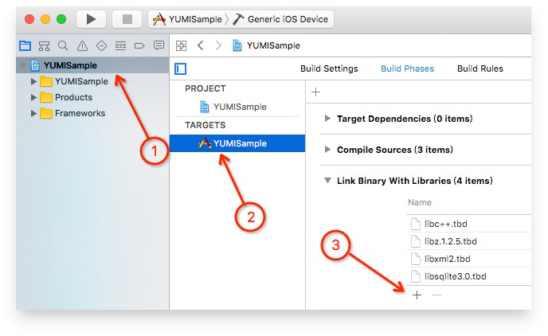

# YumiMediationSDK iOS

## Summary

1. To Readers

   This documentation is intended for developers who want to integrate Yumimobi SDK in IOS products.

2. Develop Environment

   Xcode 7.0 and above. 

   iOS 8.0 and above.

3. [ Get Demo ](https://github.com/yumimobi/YumiMediationSDKDemo-iOS.git)

## Develop Encironment Configuration 

- ### App Transport Security

  ATS (App Transport Security) proposed by WWDC 15 features an important method for Apple to boost network communication security. Non-HTTPS access will be banned by default for ios 9 and later.

  As most of materials are provided by HTTP, please set as the followings to improve fillrate：

  ```plsql
  <key>NSAppTransportSecurity</key>
  <dict>
      <key>NSAllowsArbitraryLoads</key>
      <true/>
  </dict>
  ```

  

  *The `NSAllowsArbitraryLoads` exception is required to make sure your ads are not impacted by ATS on iOS 9 devices, while `NSAllowsArbitraryLoadsForMedia` and `NSAllowsArbitraryLoadsInWebContent` are required to make sure your ads are not impacted by ATS on iOS 10 devices.*

- ### Permissions for ios 9 and later

  Upload app to App Store, and add the following peimissions to info.plist.

  ```plsql
  <-- Calendar -->
  <key>NSCalendarsUsageDescription</key>
  <string>App shall access calendar with your permission</string>
  <!-- Photos -->
  <key>NSPhotoLibraryUsageDescription</key>
  <string>App shall access photos with your permission</string>
  ```

## Integration Method

- CocoaPods ( recommend )

  CocoaPods is a dependency manager for ios, which will make it easy to manage YumiMediationSDK.

  Open Podfile, add one of the following methods to target.

  If use CocoaPods for the first time, please view [CocoaPods Guides](https://guides.cocoapods.org/using/using-cocoapods.html).

  - If need YumiMediationSDK only:

    ```ruby
    pod "YumiMediationSDK"
    ```

  - If also need other platforms:

    ```ruby
    pod "YumiMediationAdapters", :subspecs => ['AdColony','AdMob','AppLovin','Baidu','Chartboost','Domob','Facebook','GDT','InMobi','IronSource','StartApp','Unity','Vungle','Centrixlink','Mobvista','OneWay','TouTiao']
    ```

  Then run the followings at command line interface:

  ```c
  $ pod install --repo-update
  ```

  Finally, open project by workspace. 

- Manually Integrating YumiMediationSDK
  1. Download ([DownLoadPage](https://github.com/yumimobi/YumiMediationSDKDemo-iOS/blob/master/docs/iOSDownloadPage.md)) YumiMediationSDK and third-party SDK which you need.
  2. Add YumiMediationSDK and third-party SDK to your project

 

 

3. Script configuration

   Add YUMISDKConfig according to steps as shown.

 

4. Import Framework

   Import system dynamic libraries as shown.

 

## Code Sample

### Advertisement Forms

#### Banner

- ##### Initialization and banner request

  ```objective-c
  #import <YumiMediationSDK/YumiMediationBannerView.h>
  
  @interface ViewController ()<YumiMediationBannerViewDelegate>
  @property (nonatomic) YumiMediationBannerView *yumiBanner;
  @end
    
  @implementation ViewController
  
  //init yumiBanner
  - (void)viewDidLoad {
  	[super viewDidLoad];
  	self.yumiBanner = [[YumiMediationBannerView alloc] 
                       initWithPlacementID:@"Your PlacementID" 			
                         		   channelID:@"Your ChannelID" 
                                 versionID:@"Your VersionNumber"
                                  position:YumiMediationBannerPositionBottom
                        rootViewController:self];
    	self.yumiBanner.delegate = self;
    	[self.yumiBanner loadAd:YES];
      [self.view addSubview:self.yumiBanner];
  }
  @end
  ```

- ##### Reset banner size

  ```objective-c
  /// Required to set this banner view to a proper size. Use one of the predefined standard ad sizes (such as kYumiMediationAdViewBanner320x50) If you want to specify the ad size you need to set it before calling loadAd:
  /// default: iPhone and iPod Touch ad size. Typically 320x50.
  /// default: iPad ad size. Typically 728x90.
  /// If you do not need to change the default values, do not execute the following code.
  self.yumiBanner.bannerSize = kYumiMediationAdViewBanner300x250;
  ```

- ##### Remove banner

  ```objective-c
  //remove yumiBanner
  - (void)viewWillDisappear:(BOOL)animated {
      [super viewWillDisappear:animated];
      if (_yumiBanner) {
          [_yumiBanner removeFromSuperview];
          _yumiBanner = nil;
      }
  }
  ```

- ##### Delegate implementation 

  ```objective-c
  //implementing yumiBanner delegate
  - (void)yumiMediationBannerViewDidLoad:(YumiMediationBannerView *)adView{
  	NSLog(@"adViewDidReceiveAd");
  }
  - (void)yumiMediationBannerView:(YumiMediationBannerView *)adView didFailWithError:(YumiMediationError *)error{
    	NSLog(@"adView:didFailToReceiveAdWithError: %@", error);
  }
  - (void)yumiMediationBannerViewDidClick:(YumiMediationBannerView *)adView{
    	NSLog(@"adViewDidClick");
  }
  ```

- ##### Self-adaptation

  ```objective-c
  - (void)loadAd:(BOOL)isSmartBanner;
  ```

  You are available to set whether to turn on self-adaptation when making `banner` request.

  If `isSmartBanner` is `YES` ,YumiMediationBannerView will automatically adapt to size of device. 

  You are supported to get size of YumiMediationBannerView by the following method.

  ```objective-c
  - (CGSize)fetchBannerAdSize;
  ```

      

  ​	*non self-adaptation mode* 	  	  *self-adaptation mode*										

#### Interstitial

- ##### Initialization and interstitial request

  ```objective-c
  #import <YumiMediationSDK/YumiMediationInterstitial.h>
  
  @interface ViewController ()<YumiMediationInterstitialDelegate>
  @property (nonatomic) YumiMediationInterstitial *yumiInterstitial;
  @end
  
  @implementation ViewController
  //init yumiInterstitial
  - (void)viewDidLoad {
  	[super viewDidLoad];
   	self.yumiInterstitial =  [[YumiMediationInterstitial alloc] 
                                initWithPlacementID:@"Your PlacementID"
  							            channelID:@"Your channelID"
  							            versionID:@"Your versionID"
  							   rootViewController:self];
    	self.yumiInterstitial.delegate = self;
  }
  @end
  ```

- ##### Show Interstitial

  ```objective-c
  //present YumiMediationInterstitial
  - (IBAction)presentYumiMediationInterstitial:(id)sender {
  	if ([self.yumiInterstitial isReady]) {
      	[self.yumiInterstitial present];
    } else {
      	NSLog(@"Ad wasn't ready");
    }
  }
  ```

- ##### Delegate implementation

  ```objective-c
  //implementing YumiMediationInterstitial Delegate
  - (void)yumiMediationInterstitialDidReceiveAd:(YumiMediationInterstitial *)interstitial{
  	NSLog(@"interstitialDidReceiveAd");
  }
  - (void)yumiMediationInterstitial:(YumiMediationInterstitial *)interstitial
                   didFailWithError:(YumiMediationError *)error{
  	NSLog(@"interstitial:didFailToReceiveAdWithError: %@", error)
  }
  - (void)yumiMediationInterstitialWillDismissScreen:(YumiMediationInterstitial *)interstitial{
    	NSLog(@"interstitialWillDismissScreen");
  }
  - (void)yumiMediationInterstitialDidClick:(YumiMediationInterstitial *)interstitial{
    	NSLog(@"interstitialDidClick");
  }
  ```

#### Rewarded Video

- ##### Initialization and rewarded video request

  ```objective-c
  #import <YumiMediationSDK/YumiMediationVideo.h>
   
  @implementation ViewController
  - (void)viewDidLoad {
  	[super viewDidLoad];
      [[YumiMediationVideo sharedInstance] loadAdWithPlacementID:@"Your PlacementID" 
       									             channelID:@"Your channelID" 
       									             versionID:@"Your versionID"];
    	[YumiMediationVideo sharedInstance].delegate = self;
  }
  @end
  ```

- ##### Show rewarded video

  ```objective-c
  - (IBAction)presentYumiMediationVideo:(id)sender {
  	if ([[YumiMediationVideo sharedInstance] isReady]) {
      	 [[YumiMediationVideo sharedInstance] presentFromRootViewController:self];
    } else {
      	NSLog(@"Ad wasn't ready");
    }
  }
  ```

- ##### Delegate implementation

  ```objective-c
  - (void)yumiMediationVideoDidOpen:(YumiMediationVideo *)video{
  	NSLog(@"Opened reward video ad.");
  }
  - (void)yumiMediationVideoDidStartPlaying:(YumiMediationVideo *)video{
  	NSLog(@"Reward video ad started playing.");
  }
  - (void)yumiMediationVideoDidClose:(YumiMediationVideo *)video{
  	NSLog(@"Reward video ad is closed.");
  }
  - (void)yumiMediationVideoDidReward:(YumiMediationVideo *)video{
    	NSLog(@"is Reward");
  }
  ```

#### Splash

- ##### Initialization and splash request

  To ensure splash impression, it is recommended to operate as the followings when App launching.

  for example：in your `AppDelegate.m`  `application:didFinishLaunchingWithOptions:` 

  ```objective-c
  #import <YumiMediationSDK/YumiAdsSplash.h>
  ```

- #####show splash full screen

  ```objective-c
  //AppKey is a reserved field that can fill in an empty string.
  [[YumiAdsSplash sharedInstance] showYumiAdsSplashWith:@"Your PlacementID"
   											   appKey:@"nullable" 
   								   rootViewController:self.window.rootViewController 
   											 delegate:self]
  ```

- ##### show splash with bottom custom view

  ```objective-c
  //AppKey is a reserved field that can fill in an empty string.
  UIView *view = [[UIView alloc]initWithFrame:CGRectMake(0, [UIScreen mainScreen].bounds.size.height-100,
          [UIScreen mainScreen].bounds.size.width, 100)]; 
  view.backgroundColor = [UIColor redColor];
  //view is your customView.You can show your logo there.
  //warning:view's frame is nonnull.
  [[YumiAdsSplash sharedInstance] showYumiAdsSplashWith:@"Your PlacementID" 
   											   appKey:@"nullable" 
   									 customBottomView:view
                                     rootViewController:self.window.rootViewController 
   											 delegate:self];
  ```

- ##### Delegate implementation

  ```objective-c
  - (void)yumiAdsSplashDidLoad:(YumiAdsSplash *)splash{
  	NSLog(@"yumiAdsSplashDidLoad.");
  }
  - (void)yumiAdsSplash:(YumiAdsSplash *)splash DidFailToLoad:(NSError *)error{
  	NSLog(@"yumiAdsSplash:DidFailToLoad: %@", error)
  }
  - (void)yumiAdsSplashDidClicked:(YumiAdsSplash *)splash{
    	NSLog(@"yumiAdsSplashDidClicked.");
  }
  - (void)yumiAdsSplashDidClosed:(YumiAdsSplash *)splash{
    	NSLog(@"yumiAdsSplashDidClosed.");
  }
  - (nullable UIImage *)yumiAdsSplashDefaultImage{
    	return UIImage;//Your default image when app start
  }
  ```

#### Native

- ##### Initialization and request

  ```objective-c
  #import <YumiMediationSDK/YumiMediationNativeAd.h>
  
  @interface ViewController ()<YumiMediationNativeAdDelegate>
  @property (nonatomic) YumiMediationNativeAd *yumiNativeAd;
  @end
   
  @implementation ViewController
  - (void)viewDidLoad {
  	[super viewDidLoad];
   	 self.yumiNativeAd = [[YumiMediationNativeAd alloc] 
  					                        initWithPlacementID:@"Your PlacementID" 
                                                        channelID:@"Your channelID" 
                                                        versionID:@"Your versionID"];
       self.yumiNativeAd.delegate = self;
    	 [self.nativeAd loadAd:1];//You can request more than one ad.
  }
  @end
  ```

- #####Register View

  ```objective-c
  /**
   This is a method to associate a YumiNativeAd with the UIView you will use to display the native ads.
   - Parameter view: The UIView you created to render all the native ads data elements.
   - Parameter viewController: The UIViewController that will be used to present SKStoreProductViewController(iTunes Store product information) or the in-app browser. If nil is passed, the top view controller currently shown will be used.
   The whole area of the UIView will be clickable.
   */
  - (void)registerViewForInteraction:(UIView *)view
                  withViewController:(nullable UIViewController *)viewController
                            nativeAd:(YumiMediationNativeModel *)nativeAd;
  ```

- ##### Report Impression

  ```objective-c
  /**
   report impression when display the native ad.
   - Parameter nativeAd: the ad you want to display.
   - Parameter view: view you display the ad.
  */
  - (void)reportImpression:(YumiMediationNativeModel *)nativeAd view:(UIView *)view;
  ```

- ##### Delegate implementation

  ```objective-c
  /// Tells the delegate that an ad has been successfully loaded.
  - (void)yumiMediationNativeAdDidLoad:(NSArray<YumiMediationNativeModel *> *)nativeAdArray{
      NSLog(@"Native Ad Did Load.");
  }
  
  /// Tells the delegate that a request failed.
  - (void)yumiMediationNativeAd:(YumiMediationNativeAd *)nativeAd didFailWithError:(YumiMediationError *)error{
      NSLog(@"NativeAd Did Fail With Error.");
  }
  
  /// Tells the delegate that the Native view has been clicked.
  - (void)yumiMediationNativeAdDidClick:(YumiMediationNativeModel *)nativeAd{
    	NSLog(@"Native Ad Did Click.");
  }
  ```

## Debug Mode

Please select debug mode if you want to test whether ad ruturn is available for an app.

Please ensure your app has initialized YumiMediationSDK before calling debug mode.

### Integration Method

- CocoaPods ( recommend )

  ```ruby
  pod "YumiMediationDebugCenter-iOS" 
  ```


- Manually Integrating YumiMediationSDK

  Unzip the downloaded file to get our ``YumiMediationDebugCenter-iOS.framework``. Select this framework and add them to your project. Make sure to have 'Copy Items' checked.

### Call debug mode

```objective-c
#import <YumiMediationDebugCenter-iOS/YumiMediationDebugController.h>

[[YumiMediationDebugController sharedInstance] 
	presentWithBannerPlacementID:@"Your BannerPlacementID"
	     interstitialPlacementID:@"Your interstitialPlacementID"
	            videoPlacementID:@"Your videoPlacementID"
	           nativePlacementID:@"Your nativePlacementID"
	                   channelID:@"Your channelID"
	                   versionID:@"Your versionID"
	          rootViewController:self];//your rootVC
```

### Sample


Select platform integration category


Select single platform, the grey indicates  not configurated yet.


select ad category, debug single platform

